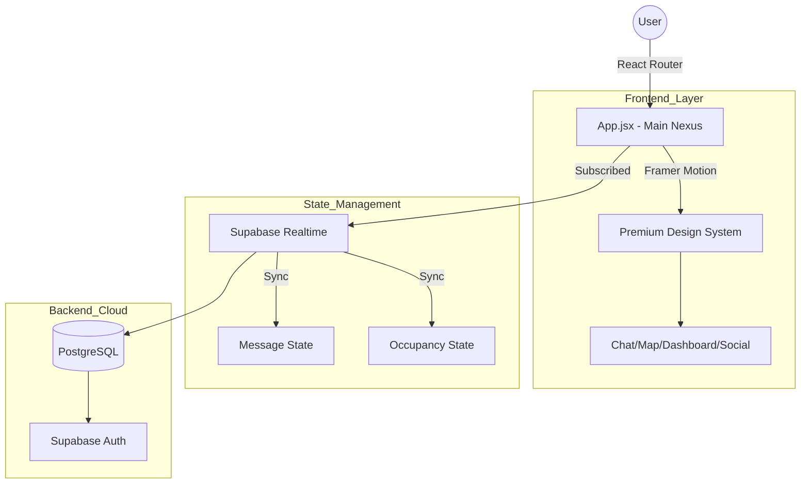

<div align="center">
  
  <h1>⚡ VibeSRM</h1>
  <p><b>Crafted by Team Bug Sneaker | For VibeCraft</b></p>
  <p><i>VibeSRM is a premium real-time campus hub that blends holographic chat with live occupancy heatmaps in a stunning "Glass & Neon" aesthetic to elevate the student experience.</i></p>

  <div align="center">
    
    
    
    
  </div>
</div>

---

## 📝 Problem Statement
University campuses lack a unified, real-time social and resource-management hub. Students often struggle to find available study zones, track real-time occupancy of campus facilities (like gyms or libraries), and connect with peers in a meaningful, "live" way. Existing apps are often purely utilitarian and fail to capture the energy and "vibe" of university life.

**VibeSRM** solves this by providing a high-fidelity, interactive "Digital Twin" of the campus, combining real-time data sync with an immersive social layer.

---

## 🌌 The "Organic Premium" Aesthetic
VibeSRM isn't just an app; it's an **atmosphere**. We've ditched generic AI layouts for a hand-crafted, immersive experience that feels "alive."

*   **Shifting Aurora**: A dynamic background of moving violet and fuchsia gradients.
*   **Floating Mesh Orbs**: Asymmetric light sources that drift naturally, creating depth.
*   **Holographic Glass**: 16px backdrop blurs with floating borders and neon refractions.
*   **Micro-Animations**: Every interaction is choreographed using Framer Motion for a fluid, tactile feel.

---

## 🚀 Visionary Features

<table border="0">
  <tr>
    <td width="50%" valign="top">
      <h3>💬 Holographic Chat Nexus</h3>
      <p>Communication that feels physical. Featuring <b>glass message bubbles</b>, holographic gradients, and a floating command input capsule.</p>
    </td>
    <td width="50%" valign="top">
      <h3>🗾 Interactive Campus Map</h3>
      <p>A living SVG-based nexus. Pulsing <b>Hotspots</b> indicate occupancy: <span style="color: #06B6D4">Cyan</span> for peace, <span style="color: #F43F5E">Rose</span> for the rush.</p>
    </td>
  </tr>
  <tr>
    <td width="50%" valign="top">
      <h3>🍱 Smart Bento Dashboard</h3>
      <p>Your campus at a glance. Real-time <b>occupancy tracking</b> for libraries, gyms, and cafes with gamified study streaks.</p>
    </td>
    <td width="50%" valign="top">
      <h3>✨ Community Pulse</h3>
      <p>A social nexus designed for connection. Join <b>Live Vibes</b>, discover squads, and find your tribe in real-time.</p>
    </td>
  </tr>
</table>

---

## 🏛️ Jury Evaluation Hub
*Quick access for the Vibecraft Judging Committee*

| Requirement | Reference / Link |
| :--- | :--- |
| **System Architecture (30%)** | [Read ARCHITECTURE.md](./ARCHITECTURE.md) |
| **Code Quality (30%)** | [Browse GitHub Repository](https://github.com/YUVRAJ-SINGH-3178/VibeSRM) |
| **Prompt Engineering (10%)** | [View PROMPTS.md](./PROMPTS.md) |
| **Local Run (10%)** | [Build Reproducibility Guide](#-build-reproducibility-mandatory) |
| **Project APK / Link** | [Live Demo Portfolio](https://github.com/YUVRAJ-SINGH-3178/VibeSRM) |

---

## 🏗️ Architecture Diagram


---

## 🛠️ The Performance Engine (Tech Stack)

| Part | Tech | Purpose |
| :--- | :--- | :--- |
| **Foundation** | `React 19` | UI reactivity and concurrent rendering. |
| **Realtime** | `Supabase` | Magic-link auth & instant data synchronization. |
| **Styling** | `Tailwind CSS` | Utility-first custom design tokens. |
| **Motion** | `Framer Motion` | High-fidelity orchestrated animations. |
| **Icons** | `Lucide React` | Consistent, accessible iconography. |

---

## 🤖 AI Tools & Prompting Strategy
VibeSRM was built using **Antigravity (Advanced Agentic AI Assistant)** for pair programming and iterative UI design.

**Prompting Strategy Summary:**
1.  **Aesthetic Priming**: Using descriptive keyword chains like *"high-end glassmorphism"*, *"midnight holographic gradients"*, and *"organic non-AI look"* to set the design tokens.
2.  **Iterative Refinement**: Building core logic (Supabase integration) first, then layering complex UI overhauls in dedicated steps (e.g., transforming the basic Chat into the "Holographic Nexus").
3.  **Cross-Context Logic**: Ensuring the AI maintained global state across multiple views (Map, Chat, Social) through incremental file views and structural outlines.

---

## ⚡ Build Reproducibility (Mandatory)

Follow these exact steps to run VibeSRM locally for judging:

### 1. Requirements
Ensure you have **Node.js 18+** (v20+ recommended) and **npm** installed.

### 2. Setup & Installation
```bash
# 1. Clone the nexus
git clone https://github.com/YUVRAJ-SINGH-3178/VibeSRM.git
cd VibeSRM

# 2. Install dependencies
npm install

# 3. Environment Config
# Create a .env file in the root and add:
VITE_SUPABASE_URL=your_project_url
VITE_SUPABASE_ANON_KEY=your_anon_key

# 4. Launch Development Server
npm run dev
```

### 3. Production Build
To verify the final bundle and performance:
```bash
npm run build
npm run preview
```

---

## 🔌 Beyond the Code
VibeSRM is built to be resilient and secure.
- ✅ **Postgres RLS**: Every user's data is isolated and protected.
- ✅ **Edge Runtime**: Optimized for global, low-latency performance.
- ✅ **Vibration API**: Subtle haptic feedback for mobile-ready chats.

---

## 👥 Meet the Team: Bug Sneaker

Our team combined expertise in design, engineering, and data to craft the ultimate campus experience.

| Member | Role | GitHub |
| :--- | :--- | :--- |
| **Yuvraj Singh** | **Team Leader** & Full-Stack Developer | [@YUVRAJ-SINGH-3178](https://github.com/YUVRAJ-SINGH-3178) |
| **Aayush Bansal** | UI/UX Designer | [@Aayush-Bansal07](https://github.com/Aayush-Bansal07) |
| **Akshat** | Database Architect  | [@Akshatgitty](https://github.com/Akshatgitty) |
| **Adarsh** | API Integration Specialist| [@Adarsh-Pandey28](https://github.com/Adarsh-Pandey28) |

---

<div align="center">
  <p>Hand-crafted with 💜 by <b>Team Bug Sneaker</b></p>
  <p><i>Elevating the student experience, one vibe at a time.</i></p>
  <br />
  
</div>
